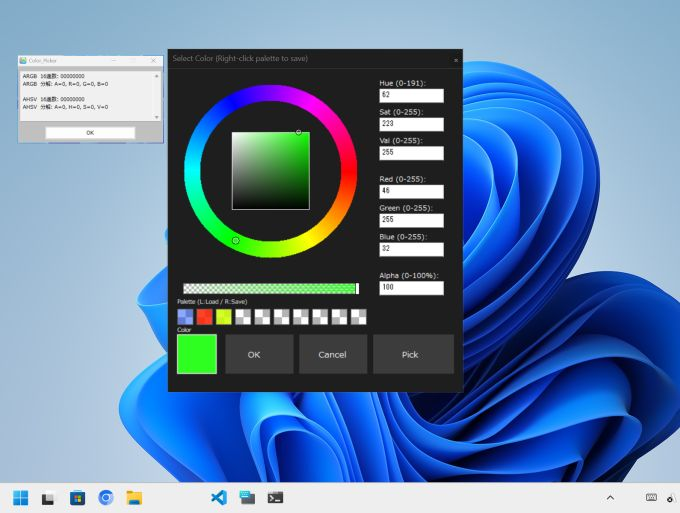
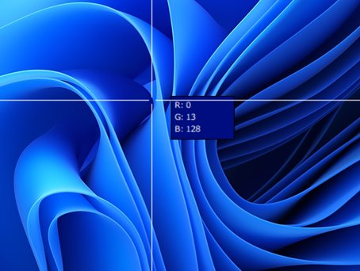

# カラーピッカー for HSP3



このプロジェクトは、HSP3で開発された高機能なカラーピッカーアプリおよび、その機能を他のアプリに組み込むためのモジュールです。

---

## ユーザー向けガイド（使い方）

このツールは、画面上の色を取得したり、パレットを使って自由な色を作成・保存したりするためのアプリケーションです。

### 1. 色を選ぶ

* **カラーサークル:** 外側の輪をドラッグして「色相（色の種類）」を選択します。
* **中央の四角:** 四角の中をドラッグして「彩度（鮮やかさ）」と「明度（明るさ）」を調整します。
* **スライダー:** 画面下のスライダーで、色の透過度（アルファ値）を調整できます。

### 2. 色を拾う（スポイト機能）



1. 「Pick」ボタンをクリックします。
2. マウスカーソルが十字に変わります。
3. 画面上の好きな場所をクリックすると、その場所の色を抽出します。
4. キャンセルしたい場合は「Esc」キーを押してください。

### 3. パレット機能

* **色を保存:** パレットの各枠を「右クリック」すると、現在作成中の色を保存できます。
* **色を読み込む:** パレットの枠を「左クリック」すると、保存した色を呼び出せます。

### 4.色を使う

* **色をコピー:** 「OK」ボタンを押すと、その色のカラーコード（RGB/HEX）をクリップボードにコピーできます。また、小窓が開き詳細が表示されるので、そこから必要な情報をコピーすることも可能です。

---

## 開発者向けガイド（モジュールの組み込み）

本モジュールを自身のHSP3プロジェクトに組み込み、カスタムカラーピッカーとして利用する方法を解説します。

### 組み込み手順

1. `color_picker.as` をプロジェクトフォルダに配置します。
2. メインのスクリプトで以下のようにインクルードしてください。

   ```hsp
   #include "color_picker.as"
   ```

### モジュールの呼び出し

以下の関数を呼び出すことで、別ウィンドウでカラーピッカーが起動します。

```hsp
// 変数(結果格納用), ダークモード(0/1), タイトルバーの色, フォント名, アルファ使用(0/1)
open_custom_color_picker result_color, 1, 0x1E1E1E, "メイリオ", 1
```

### パラメータ詳細

* `result_color`: 色の結果（0xAABBGGRR形式）が格納される変数。
* `is_dark`: `1`でダークモード、`0`でライトモード。
* `bar_color`: Windows 11のタイトルバー色（カラーコード）。
* `f_name`: UIで使用するフォント名。
* `use_alpha`: `1`で透過度あり、`0`でなし。

また、`color_picker.as`内の`SET_OLD`の値を`1`にすると`open_custom_color_picker`を呼び出した際の`result_color`に格納している値を`old`として新しい値`new`と並べて小窓に表示することが出来ます。

### 特徴

* **高DPI対応:** `SetThreadDpiAwarenessContext` を使用しており、高解像度環境でも適切に描画されます。
* **Windowsダークモード対応:** OSのテーマ設定に合わせてウィンドウの枠をダークモード化できます。
* **JSONパレット管理:** 保存データは `utils\color_palette.json` に出力され、設定を保持可能です。

### 注意事項

* `user32.as`, `kernel32.as` をインクルードする必要があります。
* `utils` フォルダが存在しない場合、自動的に生成されます。


---

## ライセンス

本プロジェクトは `NYSL(煮るなり焼くなり好きにしろライセンス)` の下で公開されています。

`煮るなり焼くなり好きにしてください。`

- **著作権**: © 2026 nyorotan

## バージョン情報

- **バージョン**: v1.0.0
- **作者**: nyorotan
